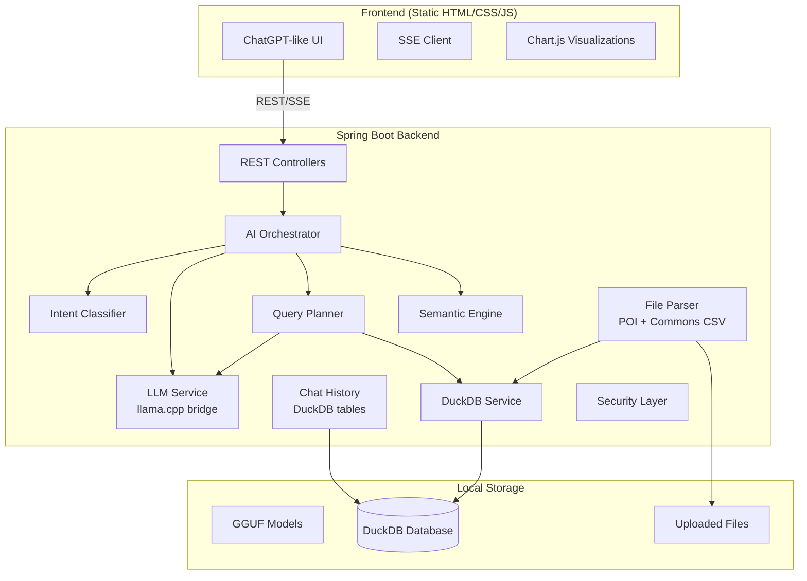

# Offline AI Data Analyst — Implementation Plan

## Background

The project at `d:\manohar\Development\DataAnalyst\Data-Analyst` is currently a bare Spring Boot 3.5.13 scaffold with only the main application class. We need to build the complete production-grade Offline AI Data Analyst from scratch.

> [!IMPORTANT]
> This is a massive undertaking. The plan is organized into **6 phases** that can be built and tested incrementally. Each phase produces a working, testable application.

---

## User Review Required

> [!WARNING]
> **Package Structure Cleanup**: The current package is `com.enterprise.dataanalyst.Data.Analyst` — this uses uppercase folder names which is non-standard Java convention. I will restructure to `com.enterprise.dataanalyst` with proper sub-packages. The main class stays as `DataAnalystApplication`.

> [!IMPORTANT]
> **LLM Model Choice**: The plan uses **llama.cpp** via JNI/Process bridge with **GGUF models** (Qwen2.5-1.5B-Instruct or Phi-3-mini). For a CPU-only laptop, I recommend **Qwen2.5-1.5B-Instruct-Q4_K_M.gguf** (~1GB) as the default. The model file must be placed at `models/` directory. Do you want me to:
> - (A) Auto-download the model on first run (requires one-time internet)
> - (B) Expect the user to place the GGUF file manually
> - (C) Bundle a tiny model (~400MB Phi-3.5-mini-Q4) for quick testing, upgrade later

> [!IMPORTANT]
> **llama.cpp Binary**: We need the `llama-server` (or `llama-cli`) native binary for your OS. Options:
> - (A) Bundle pre-compiled Windows binary in the project
> - (B) Expect user to install separately
> - (C) Use a Java JNI binding library like `jllama`

---

## Open Questions

1. **Model size vs quality**: Smaller models (1.5B) are fast on CPU but less capable. Larger models (7B) are better but slow (~2-5 tokens/sec on CPU). Which do you prefer?
2. **Do you have a GPU?** If you have an NVIDIA GPU, we can enable CUDA acceleration for much faster inference.
3. **Target dataset size**: What's the largest CSV/Excel file you expect to use? This affects chunking and memory strategies.

---

## Architecture Overview



### AI Reasoning Pipeline (NOT text-to-SQL)

```
User Prompt
  → Intent Classification (CHITCHAT / DATA_ANALYSIS / SEMANTIC / FOLLOW_UP / etc.)
  → Conversation Context Analysis (load history, detect follow-ups)
  → Semantic Understanding (map user terms → dataset columns)
  → Schema Mapping (understand available tables, columns, types)
  → Query Planning (multi-step decomposition)
  → Tool Selection (SQL / Derived Column / Aggregation / Explanation)
  → Execution (DuckDB query / semantic computation / memory retrieval)
  → Result Interpretation (LLM summarizes results)
  → Streaming Response (token-by-token via SSE)
```

---

## Technology Decisions

| Component | Choice | Why |
|-----------|--------|-----|
| **Backend** | Spring Boot 3.5 + Java 17 | Required by spec. Mature, production-grade |
| **Database** | DuckDB | Embedded OLAP. No server. Columnar storage. Fast analytics on CSV/Parquet. Perfect for aggregations, window functions, analytical queries. Unlike MySQL/Postgres, DuckDB is designed for analytical workloads (column-oriented), embedded (no separate process), and can query CSV/Parquet files directly |
| **LLM Runtime** | llama.cpp (server mode) | Best CPU performance for GGUF models. Supports streaming. Cross-platform |
| **File Parsing** | Apache POI + Commons CSV | Industry standard for Excel/CSV |
| **Frontend** | Vanilla HTML/CSS/JS | Required by spec. No framework overhead |
| **Streaming** | SSE (Server-Sent Events) | Simpler than WebSocket for unidirectional streaming. Native browser support |
| **Charts** | Chart.js (bundled) | Lightweight, no CDN needed, works offline |
| **Markdown** | marked.js (bundled) | For rendering LLM markdown responses |

### Why DuckDB over MySQL/PostgreSQL

1. **Embedded**: No separate database server. Ships inside the JAR. Zero configuration.
2. **OLAP-optimized**: Columnar storage means aggregation queries (SUM, AVG, GROUP BY) are 10-100x faster than row-oriented databases.
3. **Direct file querying**: Can query CSV/Parquet files directly without importing.
4. **Analytical functions**: Native support for window functions, ROLLUP, CUBE, PIVOT — essential for data analysis.
5. **Memory efficient**: Processes data in chunks, can handle files larger than RAM.
6. **SQL compatible**: PostgreSQL-compatible SQL dialect — familiar and powerful.

---

## Proposed Changes

### Phase 1: Foundation (Backend Core + DuckDB + File Upload)

---

#### [MODIFY] [pom.xml](file:///d:/manohar/Development/DataAnalyst/Data-Analyst/pom.xml)
Add all required dependencies:
- `duckdb_jdbc` (DuckDB JDBC driver)
- `apache-poi` + `poi-ooxml` (Excel parsing)
- `commons-csv` (CSV parsing)
- `tika-core` (file type detection)
- `jackson-databind` (JSON)
- `spring-boot-starter-validation` (input validation)
- `lombok` (boilerplate reduction)
- `commons-io` (file utilities)

#### [MODIFY] [application.properties](file:///d:/manohar/Development/DataAnalyst/Data-Analyst/src/main/resources/application.properties)
Configure:
- Server port (8080)
- File upload limits (100MB)
- DuckDB path
- LLM model path
- Thread pool sizes
- CORS settings

#### [MODIFY] [DataAnalystApplication.java](file:///d:/manohar/Development/DataAnalyst/Data-Analyst/src/main/java/com/enterprise/dataanalyst/Data/Analyst/DataAnalystApplication.java)
- Move to proper package `com.enterprise.dataanalyst`
- Add `@EnableAsync`, `@EnableScheduling`
- Add startup initialization

---

#### Core Configuration

#### [NEW] `config/AppConfig.java`
- Async executor configuration
- Thread pool settings
- Bean definitions

#### [NEW] `config/DuckDbConfig.java`
- DuckDB connection management
- Connection pooling (DuckDB is single-writer, needs careful management)
- Schema initialization

#### [NEW] `config/WebConfig.java`
- CORS configuration
- Static resource handling
- SSE timeout configuration

---

#### DuckDB Module

#### [NEW] `duckdb/DuckDbService.java`
- Connection management
- Query execution (read-only by default)
- Schema introspection
- Table creation from uploads
- Result set to JSON conversion

#### [NEW] `duckdb/SchemaInfo.java`
- Table metadata model
- Column names, types, sample values
- Row count, null counts

#### [NEW] `duckdb/QueryResult.java`
- Query result wrapper
- Column headers + rows
- Metadata (execution time, row count)

---

#### File Parser Module

#### [NEW] `parser/FileParserService.java`
- Unified parsing interface
- CSV parsing (Commons CSV)
- Excel parsing (Apache POI)
- Streaming/chunked mode for large files
- Auto schema inference
- Type detection (numeric, date, text, boolean)

#### [NEW] `parser/FileValidationService.java`
- File type validation (MIME check via Tika)
- Size limits
- Malicious content detection
- Sanitization

#### [NEW] `parser/DatasetMetadata.java`
- Dataset info model (name, columns, types, row count, file size)

---

#### Upload & Dataset Controller

#### [NEW] `controller/DatasetController.java`
- `POST /api/datasets/upload` — Upload CSV/Excel
- `GET /api/datasets` — List uploaded datasets
- `GET /api/datasets/{id}` — Dataset info + schema
- `GET /api/datasets/{id}/preview` — Preview first N rows
- `DELETE /api/datasets/{id}` — Remove dataset

#### [NEW] `controller/HealthController.java`
- `GET /api/health` — System health check
- `GET /api/system/info` — System capabilities

---

### Phase 2: AI Orchestration Engine

---

#### Intent Classification

#### [NEW] `intent/IntentClassifier.java`
- Rule-based + keyword-based intent detection (fast, no LLM needed for obvious cases)
- Intent types: `CHITCHAT`, `DATA_ANALYSIS`, `SEMANTIC_REASONING`, `DATA_DISCOVERY`, `VISUALIZATION_REQUEST`, `FOLLOW_UP_CONTEXTUAL`, `EXPLANATION_REQUEST`, `SYSTEM_COMMAND`
- Confidence scoring
- Falls back to LLM classification for ambiguous cases

#### [NEW] `intent/Intent.java`
- Intent enum + metadata

#### [NEW] `intent/IntentResult.java`
- Classification result with confidence, detected entities

---

#### AI Orchestrator (Core Brain)

#### [NEW] `orchestrator/AiOrchestrator.java`
- Main orchestration engine
- Routes based on intent
- Manages multi-step execution
- Coordinates LLM, DuckDB, semantic engine
- Produces streaming responses

#### [NEW] `orchestrator/QueryPlan.java`
- Multi-step execution plan
- Steps: schema_lookup, column_mapping, sql_generation, execution, interpretation

#### [NEW] `orchestrator/ToolRegistry.java`
- Available tools: SQL_QUERY, SCHEMA_INSPECT, DERIVE_COLUMN, AGGREGATE, EXPLAIN, VISUALIZE
- Tool selection based on intent + context

#### [NEW] `orchestrator/ExecutionContext.java`
- Current conversation state
- Active dataset
- Previous results
- User preferences

---

#### Semantic Understanding

#### [NEW] `semantic/SemanticMapper.java`
- Maps user terms → column names using:
  - Exact match
  - Fuzzy match (Levenshtein distance)
  - Synonym detection (built-in synonym dictionary)
  - LLM-assisted mapping for complex cases
- Example: "salary" → matches "ctc", "compensation", "annual_income"

#### [NEW] `semantic/SynonymDictionary.java`
- Built-in synonym mappings for common business terms
- Expandable per-dataset

#### [NEW] `semantic/DerivedColumnEngine.java`
- Runtime-generated derived fields
- Sentiment analysis (keyword-based, no external model)
- Age group binning
- Revenue categorization
- Risk scoring heuristics

---

### Phase 3: LLM Integration + Streaming

---

#### LLM Module

#### [NEW] `llm/LlmService.java`
- Interface for LLM operations

#### [NEW] `llm/LlamaCppService.java`
- Manages llama.cpp server process (starts/stops with app)
- HTTP client to llama.cpp's OpenAI-compatible API
- Token streaming via SSE
- Request queuing (single model, sequential requests)
- Timeout and error handling

#### [NEW] `llm/LlmRequest.java`
- Prompt + parameters model

#### [NEW] `llm/LlmResponse.java`
- Streaming token response

#### [NEW] `llm/PromptTemplateEngine.java`
- System prompts for each intent type
- SQL generation prompts (with schema context, safety rules)
- Summarization prompts
- Planning prompts
- Safety prompts (prevent hallucinated columns, dangerous SQL)

#### [NEW] `llm/PromptSanitizer.java`
- Strip injection attempts from user input
- Validate generated SQL before execution
- Prevent filesystem access, DROP/ALTER/DELETE commands

---

#### Streaming Controller

#### [NEW] `controller/ChatController.java`
- `POST /api/chat` — Send message, get SSE stream response
- `POST /api/chat/cancel` — Cancel current generation
- SSE event types: `token`, `sql_preview`, `chart_data`, `error`, `done`

#### [NEW] `streaming/SseEmitterService.java`
- SSE emitter management
- Timeout handling
- Client disconnect detection

---

### Phase 4: Chat History & Conversations

---

#### History Module

#### [NEW] `history/ChatHistoryService.java`
- Create/list/delete conversations
- Add messages to conversations
- Load conversation context
- Context compression (summarize old messages)

#### [NEW] `history/Conversation.java`
- Conversation model (id, title, created_at, updated_at)

#### [NEW] `history/ChatMessage.java`
- Message model (id, conversation_id, role, content, metadata, timestamp)

#### [NEW] `history/ConversationRepository.java`
- DuckDB-based persistence
- Schema: `conversations` table, `messages` table

#### Controller

#### [NEW] `controller/ConversationController.java`
- `GET /api/conversations` — List all conversations
- `POST /api/conversations` — Create new
- `GET /api/conversations/{id}` — Get with messages
- `PUT /api/conversations/{id}` — Rename
- `DELETE /api/conversations/{id}` — Delete
- `POST /api/conversations/{id}/messages` — Add message

---

### Phase 5: Frontend (ChatGPT-like UI)

---

All files in `src/main/resources/static/`:

#### [NEW] `index.html`
- Main HTML shell
- Sidebar + main content area
- Modal containers
- Link to all CSS/JS

#### [NEW] `css/styles.css`
- Complete design system
- CSS custom properties for theming
- Dark/light mode
- Glassmorphism effects
- Animations and transitions
- Responsive breakpoints

#### [NEW] `css/chat.css`
- Chat message bubbles
- Typing animation
- Code block styling
- Table rendering in messages
- Streaming cursor animation

#### [NEW] `css/sidebar.css`
- Conversation list
- Active state
- Hover effects
- New chat button

#### [NEW] `css/components.css`
- Upload dropzone
- Dataset explorer cards
- Settings panel
- SQL preview panel
- Chart panel
- Modal styles
- Toast notifications

#### [NEW] `js/app.js`
- Main application initialization
- Theme management
- Keyboard shortcuts
- Global state management

#### [NEW] `js/chat.js`
- Chat message rendering
- SSE connection management
- Streaming token display
- Typing animation
- Markdown rendering
- Code syntax highlighting
- Table rendering

#### [NEW] `js/sidebar.js`
- Conversation list management
- New/rename/delete conversations
- Active conversation tracking
- Search/filter

#### [NEW] `js/upload.js`
- Drag-and-drop upload
- File validation
- Progress tracking
- Dataset list management

#### [NEW] `js/dataset.js`
- Dataset explorer
- Schema display
- Data preview table
- Column statistics

#### [NEW] `js/charts.js`
- Chart rendering (Chart.js)
- Auto chart type selection
- Chart export

#### [NEW] `js/api.js`
- API client module
- All backend calls
- Error handling
- SSE management

#### [NEW] `js/settings.js`
- Settings panel
- Theme toggle
- Model selection
- Configuration

#### [NEW] `js/utils.js`
- Markdown parser
- Date formatting
- Debounce/throttle
- Virtual scrolling helper

#### Bundled Libraries (no CDN — fully offline)

#### [NEW] `js/lib/chart.min.js` — Chart.js library
#### [NEW] `js/lib/marked.min.js` — Markdown parser
#### [NEW] `js/lib/highlight.min.js` — Code syntax highlighting

---

### Phase 6: Security, Polish & Deployment

---

#### Security

#### [NEW] `security/QuerySandbox.java`
- SQL validation before execution
- Whitelist: SELECT, WITH, EXPLAIN
- Blacklist: DROP, ALTER, DELETE, INSERT, UPDATE, CREATE (except temp views)
- Parameter sanitization

#### [NEW] `security/FileSecurityService.java`
- Upload validation
- Path traversal prevention
- MIME type verification
- Size limits

#### [NEW] `security/InputSanitizer.java`
- Prompt injection prevention
- HTML/JS stripping
- Context sanitization

---

#### Deployment

Config for `jpackage`:
- Bundle JRE + Spring Boot JAR
- Include `models/` directory with GGUF file
- Include `llama-server` binary
- Create Windows installer (.msi or .exe)
- First-run initialization script

---

## Database Schema (DuckDB)

```sql
-- Metadata tables (persistent)
CREATE TABLE IF NOT EXISTS conversations (
    id VARCHAR PRIMARY KEY,
    title VARCHAR NOT NULL,
    dataset_id VARCHAR,
    created_at TIMESTAMP DEFAULT CURRENT_TIMESTAMP,
    updated_at TIMESTAMP DEFAULT CURRENT_TIMESTAMP
);

CREATE TABLE IF NOT EXISTS messages (
    id VARCHAR PRIMARY KEY,
    conversation_id VARCHAR NOT NULL,
    role VARCHAR NOT NULL, -- 'user', 'assistant', 'system'
    content TEXT NOT NULL,
    metadata JSON, -- SQL used, chart data, intent type, etc.
    created_at TIMESTAMP DEFAULT CURRENT_TIMESTAMP,
    FOREIGN KEY (conversation_id) REFERENCES conversations(id)
);

CREATE TABLE IF NOT EXISTS datasets (
    id VARCHAR PRIMARY KEY,
    name VARCHAR NOT NULL,
    file_path VARCHAR NOT NULL,
    file_type VARCHAR NOT NULL,
    table_name VARCHAR NOT NULL,
    row_count BIGINT,
    column_count INTEGER,
    schema_json JSON,
    uploaded_at TIMESTAMP DEFAULT CURRENT_TIMESTAMP
);

-- User data tables are created dynamically per upload
-- Example: CREATE TABLE dataset_xyz AS SELECT * FROM read_csv('path/to/file.csv')
```

---

## Verification Plan

### Automated Tests
1. `mvn clean compile` — Ensure project builds
2. `mvn spring-boot:run` — Application starts successfully
3. Test file upload via browser
4. Test chat interaction end-to-end
5. Verify SSE streaming works in browser

### Manual Verification
1. Upload a sample CSV file
2. Ask "hello" → should get chitchat response (no SQL)
3. Ask "show me top 5 rows" → should query DuckDB
4. Ask "what columns are available?" → schema discovery
5. Verify dark/light theme toggle
6. Verify conversation history persists across page reloads
7. Verify streaming token rendering

---

## Step-by-Step Roadmap

| Phase | Description | Est. Files | Testable Output |
|-------|-------------|------------|-----------------|
| **1** | Foundation: pom.xml, DuckDB, File Parsing, Upload API | ~15 files | Upload CSV, see schema, preview data |
| **2** | AI Orchestrator: Intent, Semantic, Planner | ~12 files | Intent classification working |
| **3** | LLM + Streaming: llama.cpp bridge, SSE, Chat API | ~10 files | Chat with streaming responses |
| **4** | Chat History: Conversations, persistence | ~6 files | Multiple conversations, history |
| **5** | Frontend: Complete ChatGPT-like UI | ~15 files | Full working UI |
| **6** | Security, Polish, Deployment config | ~5 files | Production-ready |

> [!TIP]
> **Phase 1-3 can work with a rule-based fallback** when no LLM model is available. The system will use template responses for chitchat and direct SQL generation for simple queries. Once llama.cpp is set up with a GGUF model, the full AI reasoning pipeline activates.

---

## Future Enhancements

- PDF/DOCX/JSON/Parquet file support
- Vector embeddings for semantic search (using a small embedding model)
- Multi-dataset JOIN queries
- Export reports (PDF/HTML)
- Scheduled analysis
- Plugin system for custom analytics
- Model fine-tuning on user's data patterns
